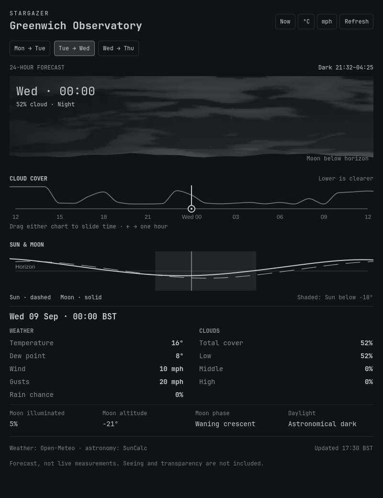

# Stargazer

An observing-night forecast in your Omarchy bar.

**Version 0.1.0.** Three observing nights, hourly cloud layers, wind/gusts, temperature/dew point, rain probability, Moon illumination/altitude, and astronomical darkness. The panel follows Omarchy's current theme. No map, alerts, or specialized seeing/transparency forecast is included.

Stargazer is an independent Omarchy Quattro plugin, ID `chicks.stargazer`. No account or API key is required. Original code is MIT-licensed; the included SunCalc library retains its BSD 2-Clause license. See [THIRD_PARTY.md](THIRD_PARTY.md).



## Use

Click the Moon icon to open the panel. The panel shows a sliding 24-hour window over the three-night forecast. Drag either the cloud or Sun/Moon chart left to move forward in time, or right to go back; release to settle on an hour. Left/Right (h/l) steps one hour continuously across midnight and noon. Clicking a chart selects and centers that time.

Paired-day tabs (Sun → Mon) and Up/Down (k/j) remain shortcuts to observing nights. The scene shows the selected calendar day alongside its time. Now centers the current forecast hour. At the forecast limits the window stops sliding and the handle approaches its edge.

- Escape closes; Tab/Shift-Tab switches among the host bar's panels.
- N or Now returns to the current forecast hour, including its observing night. The bar tooltip always describes that hour, independently of scrubbing. If current-hour data is unavailable, Now requests a refresh.
- R or Refresh requests an update. Middle-clicking the bar icon also refreshes.
- U or the temperature button switches °C/°F; W or the wind button switches mph/km/h. These are session view switches; configure persistent defaults below.
- The illustrative sky changes with daylight and total cloud cover; fixed stars and cloud shapes are not a sky map or a prediction of individual clouds. The Moon marker uses calculated altitude, not azimuth or phase shape.
- The cloud timeline uses a smooth, bounded interpolation between hourly values and rises with cloud cover; gaps mean missing values. Exact percentages and cloud layers appear below.
- The shaded sky-track region is astronomical darkness (Sun below −18°). The dashed line is the Sun; the solid line is the Moon.

The forecast's location timezone is used for labels. Both repeated fall-back hours are retained, and spring-forward nights contain 23 hours. SunCalc darkness crossings are sampled to the nearest minute; lunar position/illumination are approximate calculations, not forecast measurements.

## Requirements

- Omarchy Quattro with the current `qs.Ui` BarWidget/KeyboardPanel contract. Tested on Omarchy 4.0.2-1.
- Python 3.9 or newer with system timezone data (standard library only).
- Internet access to `api.open-meteo.com` for weather. Astronomy is calculated locally.

The provider receives your configured latitude/longitude. No coordinates or credentials are built into this repository. Updates are cached for 30 minutes. A manual refresh has a one-minute minimum interval; multiple monitor instances share a per-location lock/cache. Network requests time out after 12 seconds. A last-good forecast is marked as saved if refreshing fails; missing data is never displayed as clear skies.

Cache: `$XDG_CACHE_HOME/omarchy-stargazer`, or `~/.cache/omarchy-stargazer`. It contains location-specific weather. Removing the plugin does not automatically delete that cache; it can be removed separately if desired.

## Install

```sh
omarchy plugin add https://github.com/chrhicks/omarchy-stargazer --enable
```

Configure your own observing location before it will request a forecast. The numbers below are placeholders, not runnable coordinates:

```text
omarchy bar set chicks.stargazer locationName "Your observing site"
omarchy bar set chicks.stargazer latitude YOUR_LATITUDE
omarchy bar set chicks.stargazer longitude YOUR_LONGITUDE
omarchy bar set chicks.stargazer temperatureUnit c
omarchy bar set chicks.stargazer windUnit mph
```

Settings are stored in your user `shell.json`. No other widget needs to be replaced. An unconfigured installation shows setup guidance and makes no forecast request.

## Update and remove

```sh
omarchy plugin update chicks.stargazer
omarchy plugin disable chicks.stargazer
omarchy plugin remove chicks.stargazer
```

Disabling removes the widget from the bar, including its widget settings; record your location settings before disabling if you want to reuse them. Removal deletes the installed Git checkout. The forecast cache remains in the location documented above.

## Develop and verify

Read [CODING_STANDARDS.md](CODING_STANDARDS.md) for the readability target and implementation defaults. The main panel coordinates state and refresh. `SkyScene.qml` draws the illustration; `ForecastCharts.qml` owns the plots; `TimeScrubber.qml` emits selected timestamps; `ForecastReadings.qml` binds persistent controls. `ForecastModel.js` owns time/astronomy calculations, and `forecast.py` owns provider/cache boundaries.

Development checks require Qt's `qmlformat`, `qmllint`, and `qmltestrunner`, Node, Ruff, and Biome 2.5.10 or compatible. These add no production dependencies. The tools can be on PATH or supplied by uppercase environment variables such as `RUFF` and `BIOME`; Qt tools also resolve from `/usr/lib/qt6/bin`.

```sh
python3 tools/check.py
python3 tools/check.py --format  # apply formatters, then run the same checks
```

The check includes formatting, zero-warning QML lint against the installed host, Python lint and tests, JavaScript tests, plugin validation, and both full-panel Qt drag replays. The replays run offscreen with inert host processes and synthetic data; they do not change the desktop or request a forecast. Missing values, DST/noon boundaries, cache fallback/cooldown, cloud-buffer reuse, close/cancel behavior, persistent reading controls, and independent current-hour tooltips are covered.

To retain a screenshot and replay output for inspection:

```sh
python3 tools/profile-panel.py --out /tmp/stargazer-panel-profile --chart sky
QT_QPA_PLATFORM=offscreen QT_QUICK_BACKEND=software QT_QPA_PLATFORMTHEME= QT_STYLE_OVERRIDE=Fusion /usr/lib/qt6/bin/qmltestrunner -import /tmp/stargazer-panel-profile -input /tmp/stargazer-panel-profile/tst_profile.qml
```

Use `--chart cloud` for the other surface, or `--moves 6000` for a longer replay. The fixture saves `panel.png` to its output directory. Synthetic input and software rendering establish different evidence from native interaction.

For an isolated Qt cloud-render check (no desktop shell changes), run:

```sh
mkdir -p /tmp/stargazer-cloud-check
QT_QPA_PLATFORM=offscreen QT_QUICK_BACKEND=software QT_QPA_PLATFORMTHEME= QT_STYLE_OVERRIDE=Fusion /usr/lib/qt6/bin/qml tests/cloud-render.qml
```

This saves 12 clear/partial/overcast day/twilight/night fixtures in `/tmp/stargazer-cloud-check`. Filenames include paint time in milliseconds; cold field generation is included in the first cloudy frame. Inspect these images separately from testing the full panel.

See [release verification](docs/release-verification.md) for the tested environment and practical limits, and [CHANGELOG.md](CHANGELOG.md) for release notes.

## Data and license

Original code is MIT-licensed. SunCalc retains its BSD 2-Clause license. Weather is supplied by Open-Meteo; see [THIRD_PARTY.md](THIRD_PARTY.md) for attribution and provider terms.

- [Omarchy shell plugin reference](https://github.com/omacom/omarchy/blob/quattro/manual/32-shell-plugins.md)
- [Open-Meteo documentation](https://open-meteo.com/en/docs)
